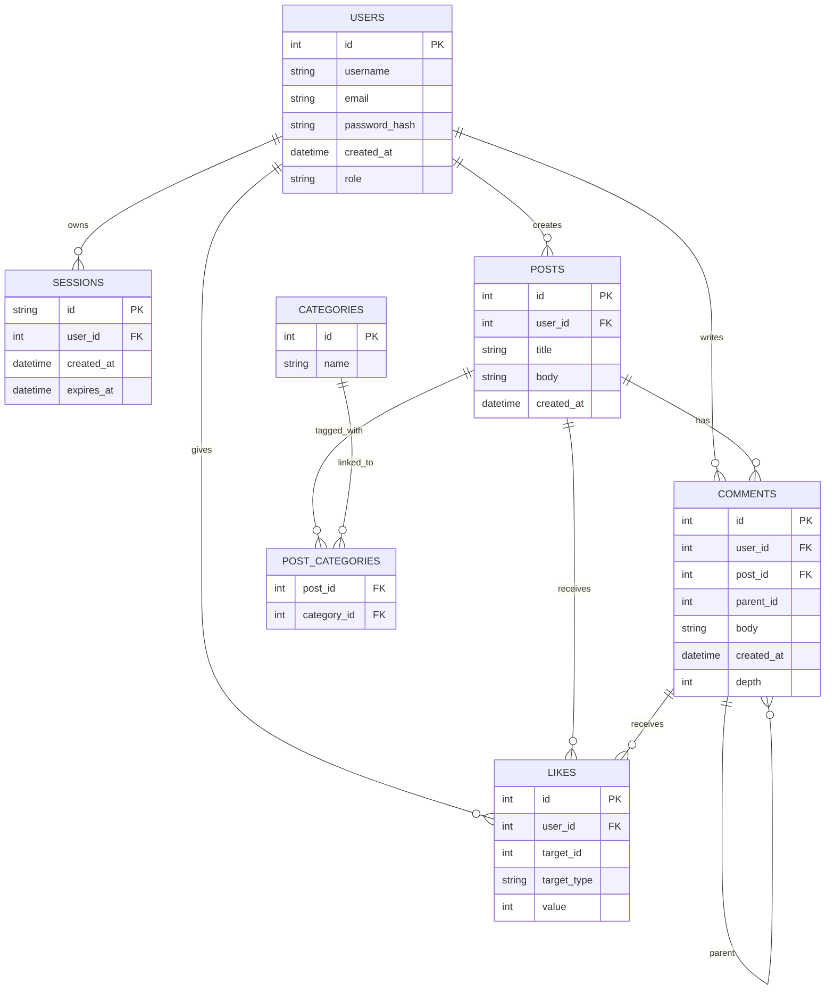

# FORUM

Go-based and **Hacker News inspired** web **Forum** for user communication, post categorization, and interaction with likes/dislikes, using **SQLite** for data storage and secure authentication.

---

## Technologies Used

* **Backend:** Go (Golang)
* **Web Framework:** Standard Library (`net/http`)
* **Database:** SQLite3
* **Styling:** Custom CSS (Hacker News inspired aesthetic)
* **Deployment:** Docker (Multi-stage build)
* **Authentication:** bcrypt for password hashing, DB-backed sessions.

---

## Project Structure

```
forum/
└── src/
    ├── Dockerfile              # Docker configuration (multi-stage build)
    ├── runserver.sh            # Bash script to build and run the Docker container
    ├── go.mod                  # Go module definition
    ├── go.sum                  # Go dependencies
    ├── cmd/server/
    │   └── main.go             # Application entrypoint
    ├── internal/
    │   ├── auth/               # Handlers and repository methods for user Auth (register/login/logout)
    │   │   └── auth.go
    │   ├── categories/         # Handlers and repository methods for Category management
    │   │   └── categories.go
    │   ├── comments/           # Handlers and repository methods for nested Comments
    │   │   └── comments.go
    │   ├── config/             # Application setup, database initialization, and routing
    │   │   └── config.go       
    │   ├── errmsg/             # Centralized validation logic and error messages
    │   │   └── errormessage.go 
    │   ├── models/             # Core application data models (User, Post, Comment, Session, etc.)
    │   │   └── models.go       
    │   ├── posts/              # Post lifecycle, retrieval, and polymorphic LikeHandler
    │   │   └── posts.go        
    │   ├── sessions/           # Database-backed session management
    │   │   └── sessions.go     
    │   ├── utils/              # Utility functions (Env vars, UserID lookup)
    │   │   └── utils.go        
    │   └── web/                # Template store, template rendering, and static file serving
    │       └── web.go          
    └── assets/
        ├── static/             # All CSS files
        ├── database/
        |   ├── forum.db        # SQLlite database stores all entries
        │   └── schema.sql      # Database schema (run at startup for migrations)
        └── templates/          # All HTML templates
            ├── layout.html
            ├── posts.html
            ├── post.html
            └── ... (other templates)
```
## Database Schema


---

## Installation

### Standard

1. Clone the repository:
```bash
git clone https://01.tomorrow-school.ai/git/dkyzyr/forum.git
cd src
```
2. Install dependencies:
```bash
go mod tidy
```
3. Run the application:
```bash
go run cmd/server/main.go
```
- Creates `internal/database/forum.db` automatically via migrations.
4. Access at `http://localhost:8080`.

**The recommended way to run the application is via Docker.**

### Docker

1. **Turn on Docker:** Docker should be running.

2. **Run the script:** The `runserver.sh` script handles building the multi-stage Docker image and running the container. Pass the local IP and port you want to expose the server on.
```bash
cd src

chmod +x runserver.sh

./runserver.sh 127.0.0.1:8080
```
3. **Access:** Once the script finishes, access the application at `http://127.0.0.1:8080`.

---

## Usage

* **Register/Login**: Use `/register` to create an account and `/login` to access authenticated features.
* **Posts**: View all posts at `/posts`, create at `/posts/create`, view a single post at `/posts/<id>`.
* **Filtering**: Filter posts by category via `/posts?category=<id>` or by user-specific types (created, liked) via the dropdown on the posts page.
* **Comments**: Add/delete comments on post detail pages (`/posts/<id>`). The system supports **nested comments** up to a depth of 9.
* **Categories**: View all categories at `/categories`, and create a new category at `/categories/create`.
* **Likes/Dislikes**: Use the voting links on post list and detail pages for both posts and comments.
* **Logout**: Use `/logout` to end your session.

---

## Security

* **Password Encryption**: Uses the industry-standard `golang.org/x/crypto/bcrypt` for secure, slow password hashing.
* **Cookies**: Secure session cookies are used with `HttpOnly`, and configured to be `Secure` (HTTPS only) and `SameSite=Strict`.
* **Input Validation**: All user-submitted data is validated (email format, username length, password complexity, content lengths) via `errmsg.go`.
* **Database Constraints**: Security and integrity are enforced at the database level with foreign keys, cascading deletes, unique indexes on email/username, and check constraints on content length in `schema.sql`.

---

## Dependencies

* `github.com/mattn/go-sqlite3`: SQLite driver
* `golang.org/x/crypto/bcrypt`: Password hashing
* Standard Go libraries: `net/http`, `html/template`, etc.

---

## Notes

* **HTTPS** is highly recommended in production environments for truly secure cookies and traffic.
* Database migrations run automatically on startup (`schema.sql`) to ensure the database is always up-to-date.
* Footer has few usefull links.
